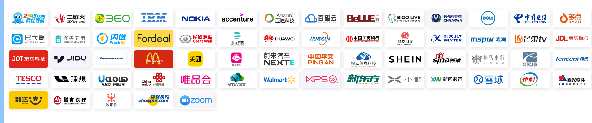

# 一、Airflow（面向研发人员Python）

> 是数据工程中最受欢迎的开源工作流管理平台之一，用于管理任务及其工作流的自动化。

Apache Airflow是一个**强大的调度器**，用于以**编程**方式编写、调度和监控工作流程。它是一个工作流引擎，可以轻松地调度和运行你的复杂数据管道。它将确保你的数据管道的每个任务将以正确的顺序执行。并确保每个任务得到所需的资源。

## 1.1 Airflow在行业中的应用

- 大数据。
- 机器学习。
- 计算机软件。
- 金融服务。
- IT服务。
- 银行业等

**例如：**

- 运维人员，定时对服务器执行脚本某些脚本，最简单的方式是添加一些crond任务，但如果想追溯各个任务的执行结果时？
- 在大数据场景下，每隔一段时间需导出线上数据、导入到大数据平台、触发数据处理等多个子操作，且各个子操作含有[依赖关系](https://www.zhihu.com/search?q=依赖关系&search_source=Entity&hybrid_search_source=Entity&hybrid_search_extra={"sourceType"%3A"answer"%2C"sourceId"%3A2817776078})时？
- 在管理大量主机时，想要一个统一的[作业管理](https://www.zhihu.com/search?q=作业管理&search_source=Entity&hybrid_search_source=Entity&hybrid_search_extra={"sourceType"%3A"answer"%2C"sourceId"%3A2817776078})平台，能在上面定义各种任务来管理下面的设备？

## 1.2 Apache Airflow的特点

- **易用性**你只需要一点python知识就可以理解。
- **开源社区**-Airflow是免费的，并且有一个庞大的活跃用户社区。
- **集成**--现成的操作符让你可以将Airflow与云平台（谷歌、AWS、Azure等）集成。
- **用标准的Python编码--**你可以使用Python创建灵活的工作流，而无需了解其他技术或框架。
- **图形用户界面**--监控和管理工作流，检查正在进行和已经完成的任务的状态。

## 1.3 缺点

1. 存在性能问题  dag采用 pull 模式，dag达到一定量级出现明显性能下降

2. Python开发二开难度大

3. 镜像大

   

# 二、DolphinScheduler（可视化为主）

## 2.1 定位

DolphinScheduler 的定位是 **大数据** **工作流** 调度 ，针对大数据体系，竞品有 : Oozie、Azkaban、Airflow

> 注 : kettle,xxl-job ,Spring batch 的定位任务调度,非大数据体系,对大数据体系的支持较弱,而且普遍都非HA,存在单点故障. 因为产品定位的不同,所以不做对比.

## 2.2 案例

DolphinScheduler从2019年3月正式发布第一个开源1.0.0版本到现在为止五年

很多大的企业在使用调度，已超过3000+公司使用

[官方统计地址](https://github.com/apache/incubator-dolphinscheduler/issues/57)

[用户案例](https://www.slidestalk.com/DolphinScheduler/architecture_breakthrough)

## 2.3 类型支持

- 任务类型
  Appendix、Shell、SubProcess、Dynamic、Dependent、Stored Procedure、SQL、Spark、MapReduce、Python、Flink、HTTP、DataX、Sqoop、Pigeon、Conditions、Switch、SeaTunnel、Amazon EMR、Apache Zeppelin、Jupyter、Hive CLI、Kubernetes、MLflow、Openmldb、DVC、Dinky、Java、 SageMaker、 ChunJun、Pytorch、 Amazon DMS、 AWS Datasync、 Kubeflow、Apache Linkis、SSH、Vertica
- 数据源中心
	MySQL、PostgreSQL、HIVE、SNOWFLAKE、KYUUBI、Spark、 Amazon Athena、Azure SQL Database、Redshift、 Oracle、 Trino、StarRocks、 DAMENG、OceanBase、SSH、Databend、HANA、Doris

## 2.4 扩展性

### 2.4.1 功能扩展性

* 插件
* 支持 Open API 、Python 方式与第三方系统对接。
* 支持自定义任务类型

### 2.5.2 性能

* 调度能力随集群线性增长。
* 架构设计上，去中心化的多 Master 和多 Worker , 具备高可用能力。
* 弹性伸缩， Master 和 Worker 支持动态上下线。
* 采用任务队列避免过载，不会造成机器卡死。

## 2.5技术栈

DolphinScheduler技术栈 :

> 后端: SpringBoot 
> 前端: VUE
> 编译: Maven
> 元数据存储: Mysql
> 分布式无中心化设计: ZooKeeper
> 统一资源管理 : 共享存储[HDFS、S3A、MinIO]

# 三、应用场景

* ETL 
* 业务编排
* 性能优化，降低并发过程依赖

# 四、对比

|                | DolphinScheduler                 | Airflow                                                      |
| -------------- | -------------------------------- | ------------------------------------------------------------ |
| 稳定性         | 高（去中心化）                   | 高（主从架构）                                               |
| 任务支持类型   | `30多种且可自定义`               | 中(支持BashOperator、DummyOperator、VySalOperator、HiveOperator、EmailOperator,.HTTPOperator、SqlOperator等) |
| 暂停/恢复/补数 | `支持`                           | 需要杀死工作流                                               |
| 多租户支持     | `支持`                           | 不支持                                                       |
| 二开难度       | `低`(基于JAVA语言开发)           | 高(基于Python语言开发)                                       |
| 易用性         | `好`(页面图表拖拉拽生成工作流)   | 一般(编写Python脚本上传到DAG目录生成工作流)                  |
| 过载处理       | 有队列来控制高并发任务量         | 任务量大性能会下降                                           |
| 扩展性         | 强(master和worker支持动态上下线) | 一般(Executor水平扩展较为复杂)                               |

